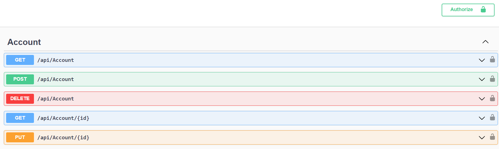
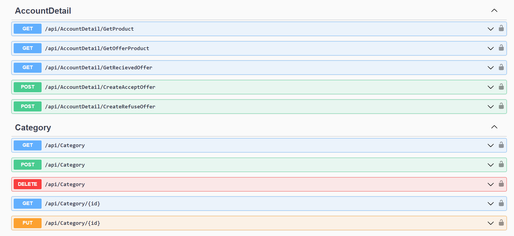
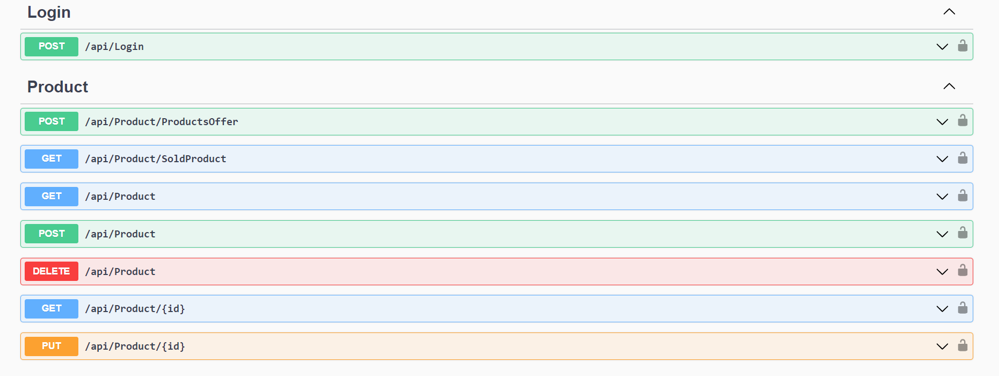

# Patika & PayCore .NET/.NET Core Bootcamp Graduation Project
Projede .NET Core 6, NHibernate, PostgreSQL ve Hangfire kullanılmıştır. Proje 7 katmandan oluşmaktadır.

### ✨ SinemYoruc-Project Katmanı
Controllerlar ve StartupExtensionlar yönetilmektedir.

### ✨ SinemYoruc-Project.Base Katmanı
Projede kullanılacak genel sınıflar yönetilmektedir.

### ✨ SinemYoruc-Project.Data Katmanı
Kullanılacak modeller ve mapping işlemleri yönetilmektedir.

### ✨ SinemYoruc-Project.Dto Katmanı
Mapping için gerekli sınıflar yönetilmektedir.

### ✨ SinemYoruc-Project.Hangfire Katmanı
Mail gönderme servisi için Hangfire paketi eklenmiştir ve JobDelayed sınıfı yönetilmektedir. Mailler kuyruğa alınıp asenkron şekilde gönderilmektedir.

### ✨ SinemYoruc-Project.NUnitTest Katmanı
Test sınıfları yönetilmektedir.

### ✨ SinemYoruc-Project.Service Katmanı
İşleyiş için gerekli olan fonksiyonları yönetmektedir.

# Installation
Öncelikle projeyi clonelayın.

```
git clone https://github.com/sinemyoruc/SinemYoruc-Project.git
```

# Usage
Projeyi cloneladıktan sonra Visual Studio 2022 programında açınız.

Daha sonra appsettings.json dosyasındaki ConnectionStrings alanını kendi database connection bilgilerinize göre doldurunuz.


Mail servisini kullanmak için SinemYoruc_Project.Hangfire paketi içindeki JobDelayed.cs dosyasından ilgili alanları kendi mail bilgilerinize göre güncelleyiniz.


# Outputs

### Swagger





# Http Methods Details

## Account
⭐  <font color="blue"> **GET**</font> **/api/Account**

Tüm kayıtlı accountları listeler.

⭐  <font color="green"> **POST**</font> **/api/Account**

Yeni account ekler. Email ve şifre validasyonları vardır. Şifre databasede MD5 ile şifrelenmiş şekilde saklanır.

⭐ <font color="red"> **DELETE**</font> **/api/Account**

Idsi verilen accountu siler.

⭐  <font color="blue"> **GET**</font> **/api/Account/{id}**

Idsi verilen accountu listeler.

⭐ <font color="orange"> **PUT**</font> **/api/Account/{id}**

Idsi verilen accountu günceller.


## AccountDetail

⭐  <font color="blue"> **GET**</font> **/api/AccountDetail/GetProduct**

Account id alır ve o accountun productlarını listeler.

⭐  <font color="blue"> **GET**</font> **/api/AccountDetail/GetOfferProduct**

Account id alır ve o accountun yaptığı offerları listeler.

⭐  <font color="blue"> **GET**</font> **/api/AccountDetail/GetRecievedOffer**

Account id alır ve o accountun ürünlerine gelen offerları listeler.

⭐ <font color="green"> **POST**</font> **/api/AccountDetail/CreateAcceptOffer**

Idsi verilen offerı kabul eder. Producttaki offerStatus true, isOfferable false, isSold true yapar.

⭐ <font color="green"> **POST**</font> **/api/AccountDetail/CreateRefuseOffer**

Idsi verilen offerı reddeder. Producttaki offerStatus false, isOfferable true, isSoldu false yapar.


## Category
⭐  <font color="blue"> **GET**</font> **/api/Category**

Kayıtlı olan kategorilerin tümünü listeler.

⭐ <font color="green"> **POST**</font> **/api/Category**

Kategori ekler.

⭐ <font color="red"> **DELETE**</font> **/api/Category**

Idsi verilen kategoriyi siler.

⭐  <font color="blue"> **GET**</font> **/api/Category/{id}**

Idsi verilen kategoriyi listeler.

⭐ <font color="orange"> **PUT**</font> **/api/Category/{id}**

Idsi verilen kategoriyi günceller.


## Login

⭐ <font color="green"> **POST**</font> **/api/Login**

Kayıtlı olan email ve şifre ile giriş yapar, token üretir.


## Product

⭐ <font color="green"> **POST**</font> **/api/Product/ProductOffer**

Product idye göre offer verir.

⭐  <font color="blue"> **GET**</font> **/api/Product/SoldProduct**

Idsi verilen ürünün offerStatus true ise satın almayı sağlar. isSold alanını true yapar.

⭐ <font color="blue"> **GET**</font> **/api/Product**

Kayıtlı tüm productları listeler.

⭐ <font color="green"> **POST**</font> **/api/Product**

Bilgileri girilen ürünü veritabanına ekler.

⭐ <font color="red"> **DELETE**</font> **/api/Product**

Idsi verilen productı siler.

⭐ <font color="blue"> **GET**</font> **/api/Product/{id}**

Idsi verilen productı listeler.

⭐ <font color="orange"> **PUT**</font> **api/Product/{id}**

Idsi verilen productı günceller.